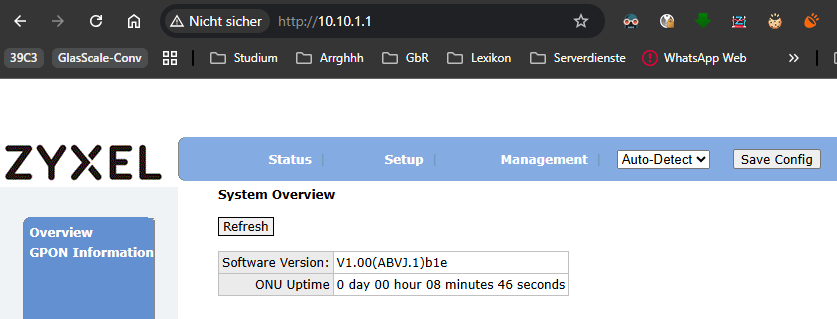
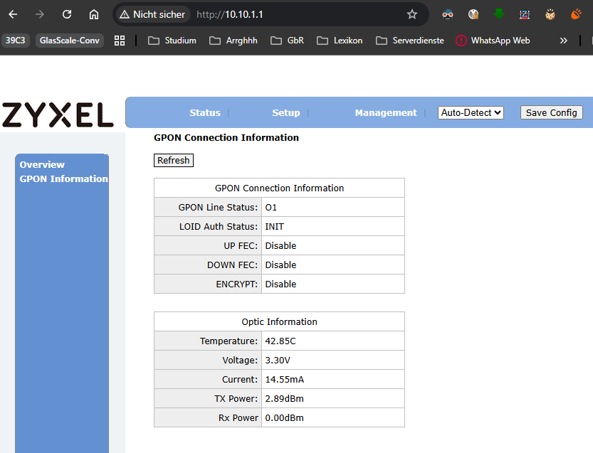
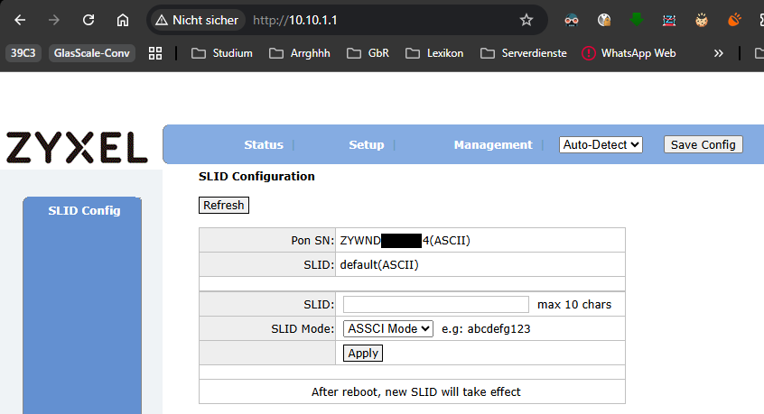

# MikroTik with Zyxel (PMG3000-D20B) or Huawei (MA5671A) SFP GPON in R-KOM/Telekom network

## English guide (Deutsche Anleitung weiter unten)
### Important Links
This guide is meant to make the switch from an ISP provided GPON modem (ONT) to your own one, like a Zyxel PMG3000-D20B or a Huawei SmartAX MA5671A, as easy as possible. 

A lot of information comes from different guides. Here is a list of all information resources and details:
- **Github repo [zyxel-gpon-sfp](https://github.com/xvzf/zyxel-gpon-sfp) by [xvzf](https://github.com/xvzf)**
- [Guide](https://jaseg.de/blog/telekom-gpon-sfp/) by [jaseg](https://github.com/jaseg/) on his blog
- [List of supported modules](https://www.computerbase.de/forum/threads/eigenes-modem-an-ftth-anschluss-via-sfp-gpon-modul.2061989/) by different ISPs in Germany, Italia, France, Portugal, Spain and Canada (Deutsche Telekom, Deutsche Glasfaser, M-Net, EON, Italien Fastweb/TIM/Vodafone, Frankreich Orange, Portugal MEO, Spanien Movistar, Canada Bell)
- Hack GPON website for [Zyxel PMG3000-D20B](https://hack-gpon.org/ont-zyxel-pmg3000-d20b/)
- Hack GPON website for [Huawei MA5671A](https://hack-gpon.org/ont-huawei-ma5671a/)
- [Huawei MA5671A Data Generator](https://gpon-sfp.felix.systems/gen_huawei.php)
- Telekom Germany [change Modem-ID website](https://www.telekom.de/hilfe/geraete/router/zubehoer/glasfaser-modem/tausch-melden)
- Telekom Germany [fiber support](https://www.telekom.de/hilfe/internet-telefonie/glasfaser/kontakt)
- Link to Telekom shop for [Zyxel PMG3000-D20B/Telekom Digitalisierungsbox Glasfasermodem](https://geschaeftskunden.telekom.de/business/produkte/internet-festnetz/geraete-zubehoer/zubehoer/digitalisierungsbox-glasfasermodem)

### Initial state and goal

In my hometown, Regensburg (Ratisbona), two ISPs joined forces to get fiber optical cables everywhere in the city. So the R-KOM (formerly known as Glasfaser Ostbayern) and Telekom Deutschland did also install fiber in my building for the GPON. 
Because of this rather unique approach, some stuff is a little bit different to the normal GPON modem exchange. 

My plan was to use a Zyxel PMG3000-D20B (Telekom sells these GPON SFP ONTs on their website) with the new [MikroTik hAP-ax-S](https://mikrotik.com/product/hap_ax_s), which has a 2.5 Gbit/s SFP slot and Wifi6 for under €70. 

### Getting access to GPON module and setting up the GPON SFP module - Zyxel PMG3000-D20B

Log in to your MikroTik device (or similar router) and with its default config applied, execute the following configuration changes:
1. Disable or remove the `sfp1` interface from the default bridge `bridge1`\
    ```/interface bridge port remove [find interface=sfp1]```
2. Deactivate auto-negotiation on `sfp1` and set it to `1G-baseX`\
    ```/interface ethernet set sfp1 auto-negotiation=no speed=1G-baseX```
3. Add a static IP address to the `sfp1` port within the network of the SFP GPON module (factory setting: 10.10.1.1/24)\
    Assign an address of ```10.10.1.2/24``` to the router\
    ```/ip address add interface=sfp1 address=10.10.1.2/24```
4. In case the module is already plugged in, you'll now need to unplug and plug it back in, or you plug it in now.\
    The initialization of the module can take up to 2 minutes. You will know that it's ready when the status of the `sfp1` port is `link ok`\
    ```/interface ethernet monitor sfp1 once```\
    Now you can check whether the module is reachable for the router\
    ```/ping 10.10.1.1 interface=sfp1```
5. To access the GPON module via the `LAN` network, we need to set up a `masquerade nat rule`\
    ```/ip firewall nat add chain=srcnat action=masquerade out-interface=sfp1 comment="GPON access"```
6. You can now access the GPON website and read its configured serial number\
    [10.10.1.1](http://10.10.1.1)\
    Default login is user:`admin` pw:`1234`

    \
    Mine came with the firmware `V1.00(ABVJ.0)b1e`. This firmware has `ssh` deactivated by default! To enable it, you'll either need to flash the firmware `V1.00(ABVJ.0)b3v` or `V2.50(ABVJ.1)b1d` to it (thanks to [maurice-w](https://github.com/maurice-w) - [source](https://github.com/xvzf/zyxel-gpon-sfp/issues/35#issuecomment-2773403653)). You can also find these in the [files subfolder](files/zyxel/)\
    In order to connect via ssh to the ONT on Windows, you need to execute the following command in the Terminal/CMD:\
    `ssh admin@10.10.1.1 -oHostKeyAlgorithms=+ssh-dss`. On recent Linux distros a ssh connection is refused due to the lack of the ancient Host Key Algorithmn support in the ssh client. The ssh access is just needed to clone the serial number of another ONT modem and set that SN in the GPON SFP.\
    \
    Line Status `O1` indicates that no fiber link is present at the moment. You want a Line Status of `O5`, which indicates a GPON link, but not necessarily a working identification at the ISP side!\
    

### Getting access to GPON module and setting up the GPON SFP module - Huawei MA5671A (not tested yet)

Log in to your MikroTik device (or similar router) and with its default config applied, execute the following configuration changes:
1. Disable or remove the `sfp1` interface from the default bridge `bridge1`\
    ```/interface bridge port remove [find interface=sfp1]```
2. Deactivate auto-negotiation on `sfp1` and set it to `1G-baseX`\
    ```/interface ethernet set sfp1 auto-negotiation=no speed=1G-baseX```
3. Add a static IP address to the `sfp1` port within the network of the SFP GPON module (factory setting: 192.168.1.10/24)\
    Assign an address of ```192.168.1.2/24``` to the router\
    ```/ip address add interface=sfp1 address=192.168.1.2/24```
4. In case the module is already plugged in, you'll now need to unplug and plug it back in, or you plug it in now.\
    The initialization of the module can take up to 2 minutes. You will know that it's ready when the status of the `sfp1` port is `link ok`\
    ```/interface ethernet monitor sfp1 once```\
    Now you can check whether the module is reachable for the router\
    ```/ping 192.168.1.10 interface=sfp1```
5. To access the GPON module via the `LAN` network, we need to set up a `masquerade nat rule`\
    ```/ip firewall nat add chain=srcnat action=masquerade out-interface=sfp1 comment="GPON access"```
6. You can now access the GPON website and read its configured (G)PON serial number\
    [192.168.1.10](http://192.168.1.10/)\
    I bought my GPON SFP already rooted on ebay. In case you need to do that, take a look at the [hack-gpon.org](https://hack-gpon.org/ont-huawei-ma5671a/) wiki\
    Default login is user:`root` pw:`admin123`

[Huawei MA5671A Data Generator](https://gpon-sfp.felix.systems/gen_huawei.php)

Pictures coming soon™

### What do I need to get the hardware setup running

As mentioned before, the `SLID` is no longer used by Telekom. Only the 12/16 digit `GPON serial number` is used to authenticate your GPON hardware with the Telekom ISP. You can either tell Telekom/R-KOM your new `GPON SN` (ASCII string!) or clone the existing serial number (in theory at least). The cloning should work within the Telekom network (when they built it & are actively running and maintaining it); in the R-KOM network (used by Telekom in Regensburg) the cloning didn't work properly. The Telekom support had to open a support ticket for the R-KOM containing the (new) `Modem-ID`. After less than 12 hours, the fiber link was up and running. Even when your ISP in Regensburg is Telekom, their website to replace the modem doesn't work, just the R-KOM can change your Modem-ID.  

After a loooong phone call with a Telekom fiber technician, I got a lot of valuable information. For example, that the `SLID` is not used anymore by either Telekom or R-KOM. The only thing left to do is to reach out to Telekom (or in my case R-KOM) and notify them about your new modem. They need the so-called `Modem-ID`, which is the same as the `Modem serial number` or `GPON serial number` - typically 12 or 16 digits. In case of the Zyxel ONT, you have to give them the `Pon SN` in ASCII from the `SLID Configuration`-tab; the `GPON SN` number printed on the module is a weird mixture of ASCII string in text format and decimal (ZYWN = 5A 59 57 4E). The `Modem-ID` is **not** the `PLOAM` or `ONT-Installationskennung`; these two are also not used anymore by Telekom. There is also the so-called `Home-ID` used by Telekom, but that's more or less just a hardware ID for your fiber installation. You'll need it once for the initial fiber registration, but it has nothing to do with your GPON modem whatsoever.

### PPPoE Connection

For the PPPoE connection, the Telekom fiber optic connection does not differ from a connection using a VDSL modem (e.g., an Allnet ALL4781, Vigor 130/166/167 or similar). You only need to add VLAN 7 to the `sfp1` interface (usually omitted with Draytek Vigor modems) and add a PPPoE client on top of it.

1. Adding `VLAN 7` to interface `sfp1`\
    ```/interface vlan add name="TelekomVLAN7" vlan-id=7 interface=sfp1```
2. Adding a PPPoE client on `VLAN 7`\
    Here you have to enter the access data, which can be found in the contract details/internet access in the Telekom online account or in your welcome letter (without the square brackets []!)\
    ```/interface pppoe-client add name="pppoe-out1" interface="TelekomVLAN7" user="[Anschlusskennung][Zugangsnummer]#[Mitbenutzernummer]@t-online.de" password="PersonalPassword" add-default-route=yes use-peer-dns=no comment="Telekom PPPoE connection" disabled=no```\
    If you do not want to use Telekom's own DNS servers (meaning you executed `use-peer-dns=no` instead of `yes` in the previous command), you still need to add your own DNS server(s) - `1.1.1.1` & `1.0.0.1` (Cloudflare), `8.8.8.8` & `8.8.4.4` (Google, usually the fastest) or `9.9.9.9` & `149.112.112.112` (Quad9 Foundation)\
    ```/ip dns set servers=9.9.9.9,149.112.112.112 allow-remote-requests=yes```
3. Check the status of the PPPoE tunnel (it can take from a few minutes up to 45 minutes until the connection is established for the first time)\
    ```/interface pppoe-client monitor pppoe-out1 once```
4. Set the new `WAN` interface\
    ```/interface list member set [find list="WAN"] interface=pppoe-out1```

---

## Deutsche Anleitung
### Wichtige Links
Diese Anleitung soll den Wechsel von einem vom Internetanbieter (ISP) bereitgestellten GPON-Modem (ONT) zu einem eigenen, wie dem Zyxel PMG3000-D20B oder einem Huawei SmartAX MA5671A, so einfach wie möglich machen. 

Viele Informationen stammen aus verschiedenen Anleitungen. Hier ist eine Liste aller Quellen und zu mehr Details:
- **Github Repo [zyxel-gpon-sfp](https://github.com/xvzf/zyxel-gpon-sfp) von [xvzf](https://github.com/xvzf)**
- [Anleitung](https://jaseg.de/blog/telekom-gpon-sfp/) von [jaseg](https://github.com/jaseg/) auf seinem Blog
- [Liste unterstützter Module](https://www.computerbase.de/forum/threads/eigenes-modem-an-ftth-anschluss-via-sfp-gpon-modul.2061989/) bei verschiedenen ISPs in Deutschland, Italien, Frankreich, Portugal, Spanien und Kanada (Deutsche Telekom, Deutsche Glasfaser, M-Net, EON, Italien Fastweb/TIM/Vodafone, Frankreich Orange, Portugal MEO, Spanien Movistar, Kanada Bell)
- Hack GPON Website für [Zyxel PMG3000-D20B](https://hack-gpon.org/ont-zyxel-pmg3000-d20b/)
- Hack GPON Website für [Huawei MA5671A](https://hack-gpon.org/ont-huawei-ma5671a/)
- [Huawei MA5671A Data Generator](https://gpon-sfp.felix.systems/gen_huawei.php)
- Telekom Deutschland [Website zur Änderung der Modem-ID](https://www.telekom.de/hilfe/geraete/router/zubehoer/glasfaser-modem/tausch-melden)
- Telekom Deutschland [Glasfaser-Support](https://www.telekom.de/hilfe/internet-telefonie/glasfaser/kontakt)
- Link zum Telekom Shop für [Zyxel PMG3000-D20B/Telekom Digitalisierungsbox Glasfasermodem](https://geschaeftskunden.telekom.de/business/produkte/internet-festnetz/geraete-zubehoer/zubehoer/digitalisierungsbox-glasfasermodem)

### Ausgangszustand und Ziel

In meiner Heimatstadt Regensburg haben sich zwei Internetanbieter zusammengeschlossen, um flächendeckend Glasfaserkabel in der Stadt zu verlegen. So haben die R-KOM (früher bekannt als Glasfaser Ostbayern) und die Telekom Deutschland auch in meinem Gebäude Glasfaser für das GPON installiert. 
Aufgrund dieses eher besonderen Ansatzes sind einige Dinge beim normalen Austausch des GPON-Modems ein wenig anders. 

Mein Plan war es, ein Zyxel PMG3000-D20B (die Telekom verkauft diese GPON SFP ONTs auf ihrer Website) mit dem neuen [MikroTik hAP-ax-S](https://mikrotik.com/product/hap_ax_s) zu nutzen, welcher einen 2,5 Gbit/s SFP-Slot und Wifi6 für unter 70 € bietet. 

### Zugriff auf das GPON-Modul und Einrichtung des GPON-SFP-Moduls - Zyxel PMG3000-D20B

Melde dich an deinem MikroTik-Gerät (oder einem ähnlichen Router) an und führe mit der angewandten Standardkonfiguration die folgenden Konfigurationsänderungen durch:
1. Deaktiviere oder entferne das `sfp1`-Interface aus der Standard-Bridge `bridge1`\
    ```/interface bridge port remove [find interface=sfp1]```
2. Deaktiviere Auto-Negotiation auf `sfp1` und setze es auf `1G-baseX`\
    ```/interface ethernet set sfp1 auto-negotiation=no speed=1G-baseX```
3. Füge dem `sfp1`-Port eine statische IP-Adresse innerhalb des Netzwerks des SFP-GPON-Moduls hinzu (Werkseinstellung: 10.10.1.1/24)\
    Weise dem Router die Adresse ```10.10.1.2/24``` zu\
    ```/ip address add interface=sfp1 address=10.10.1.2/24```
4. Falls das Modul bereits eingesteckt ist, musst du es nun aus- und wieder einstecken, oder du steckst es erst jetzt ein.\
    Die Initialisierung bzw. der Start des Moduls kann mehrere Minuten dauern. Du erkennst, dass es bereit ist, wenn der Status des `sfp1`-Ports auf `link ok` steht\
    ```/interface ethernet monitor sfp1 once```\
    Nun kannst du prüfen, ob das Modul vom Router erreichbar ist\
    ```/ping 10.10.1.1 interface=sfp1```
5. Um über das `LAN`-Netzwerk auf das GPON-Modul zugreifen zu können, müssen wir eine `masquerade nat rule` einrichten\
    ```/ip firewall nat add chain=srcnat action=masquerade out-interface=sfp1 comment="GPON access"```
6. Du kannst nun auf das Webinterface des GPON zugreifen und seine konfigurierte Seriennummer auslesen\
    [10.10.1.1](http://10.10.1.1)\
    Das Standard-Login ist User:`admin` PW:`1234`

    \
    Mein SFP ONT wurde mit der Firmware `V1.00(ABVJ.0)b1e` ausgeliefert. Bei dieser Firmware ist `ssh` standardmäßig deaktiviert! Um es zu aktivieren, musst du entweder die Firmware `V1.00(ABVJ.0)b3v` oder `V2.50(ABVJ.1)b1d` aufspielen (Danke an [maurice-w](https://github.com/maurice-w) - [Quelle](https://github.com/xvzf/zyxel-gpon-sfp/issues/35#issuecomment-2773403653)). Du findest diese auch im [files Unterordner](files/zyxel/)\
    Um in Windows auf das ONT via ssh zugreifen zu können, muss folgendes Kommando im Terminal/CMD genutzt werden:\
    `ssh admin@10.10.1.1 -oHostKeyAlgorithms=+ssh-dss`, auf aktuellen Linux Systemen ist eine ssh Verbindung scheinbar nicht möglich, da der Linux ssh Client diesen Host Key Algorithmus gar nicht mehr unterstützt.\
    \
    Der Line Status `O1` zeigt an, dass momentan keine Glasfaserverbindung besteht. Du benötigst den Line Status `O5`, was auf einen GPON-Link hindeutet, aber nicht zwingend auf eine funktionierende Identifikation auf Seiten des ISP!\
    
    
    

### Zugriff auf das GPON-Modul und Einrichtung des GPON-SFP-Moduls - Huawei MA5671A (noch nicht getestet)

Melde dich an deinem MikroTik-Gerät (oder einem ähnlichen Router) an und führe mit der angewandten Standardkonfiguration die folgenden Konfigurationsänderungen durch:
1. Deaktiviere oder entferne das `sfp1`-Interface aus der Standard-Bridge `bridge1`\
    ```/interface bridge port remove [find interface=sfp1]```
2. Deaktiviere Auto-Negotiation auf `sfp1` und setze es auf `1G-baseX`\
    ```/interface ethernet set sfp1 auto-negotiation=no speed=1G-baseX```
3. Füge dem `sfp1`-Port eine statische IP-Adresse innerhalb des Netzwerks des SFP-GPON-Moduls hinzu (Werkseinstellung: 192.168.1.10/24)\
    Weise dem Router eine Adresse von ```192.168.1.2/24``` zu\
    ```/ip address add interface=sfp1 address=192.168.1.2/24```
4. Falls das Modul bereits eingesteckt ist, musst du es nun ausstecken und wieder einstecken, oder du steckst es jetzt ein.\
    Die Initialisierung des Moduls kann bis zu 2 Minuten dauern. Du erkennst, dass es bereit ist, wenn der Status des `sfp1`-Ports auf `link ok` steht\
    ```/interface ethernet monitor sfp1 once```\
    Nun kannst du prüfen, ob das Modul für den Router erreichbar ist\
    ```/ping 192.168.1.10 interface=sfp1```
5. Um über das `LAN`-Netzwerk auf das GPON-Modul zugreifen zu können, müssen wir eine `masquerade nat rule` (NAT-Maskierungsregel) einrichten\
    ```/ip firewall nat add chain=srcnat action=masquerade out-interface=sfp1 comment="GPON access"```
6. Du kannst nun auf das Webinterface des GPON zugreifen und seine konfigurierte (G)PON-Seriennummer auslesen\
    [192.168.1.10](http://192.168.1.10/)\
    Ich habe mein GPON-SFP bereits gerootet auf eBay gekauft. Falls du das noch tun musst, wirf einen Blick in das [hack-gpon.org](https://hack-gpon.org/ont-huawei-ma5671a/) Wiki\
    Das Standard-Login ist User:`root` PW:`admin123`

[Huawei MA5671A Data Generator](https://gpon-sfp.felix.systems/gen_huawei.php)

Bilder kommen zeitnah™

### Was benötige ich, um das Hardware Setup an Glasfaser in Betrieb zu nehmen?

Wie bereits erwähnt, wird die `SLID` von der Telekom nicht mehr verwendet. Nur die 12- oder 16-stellige `GPON-Seriennummer` wird genutzt, um deine GPON-Hardware beim Internetanbieter Telekom zu authentifizieren. Du kannst der Telekom/R-KOM entweder deine neue `GPON SN` (ASCII-String!) mitteilen oder die bestehende Seriennummer klonen (zumindest in der Theorie). Das Klonen sollte innerhalb des Telekom-Netzwerks funktionieren (sofern diese es ausgebaut hat und aktiv betreibt bzw. wartet); im R-KOM-Netzwerk (das von der Telekom in Regensburg genutzt wird) funktionierte das Klonen nicht richtig. Der Telekom-Support musste ein Support-Ticket bei der R-KOM eröffnen, welches die (neue) `Modem-ID` enthielt. Nach weniger als 12 Stunden war der Glasfaser-Link einsatzbereit. Selbst wenn dein Glasfaser Internetanbieter die Telekom in Regensburg ist, kann im R-KOM Netz nur durch die R-KOM die Modem-ID des Anschlusses geändert werden, das Online-Portal der Telekom funktioniert hier nicht.

Nach einem seeehr langen Telefonat mit einem Telekom-Glasfasertechniker habe ich viele wertvolle Informationen erhalten. Zum Beispiel, dass die `SLID` weder von der Telekom noch von der R-KOM mehr verwendet wird. Das Einzige, was noch zu tun ist, ist die Telekom (oder in meinem Fall die R-KOM) zu kontaktieren und sie über das neue Modem zu informieren. Sie benötigen die sogenannte `Modem-ID`, welche dasselbe ist wie die `Modem-Seriennummer` oder `GPON-Seriennummer` - typischerweise 12 oder 16 Ziffern. Im Fall des Zyxel ONT musst du ihnen die `Pon SN` in ASCII aus dem Reiter `SLID Configuration` mitteilen; die auf dem Modul aufgedruckte `GPON SN`-Nummer ist eine seltsame Mischung aus ASCII-String im Textformat und Dezimalzahlen (ZYWN = 5A 59 57 4E). Die `Modem-ID` ist **nicht** die `PLOAM` oder `ONT-Installationskennung`; diese beiden werden von der Telekom ebenfalls nicht mehr genutzt. Es gibt auch noch die sogenannte `Home-ID`, die von der Telekom verwendet wird, aber das ist nur eine Hardware-ID für deinen Glasfaseranschluss bzw. die Glasfaserdose. Du benötigst sie einmalig für die anfängliche Glasfaser-Registrierung/-Inbetriebname deines Vertrages, aber sie hat nichts mit deinem GPON-Modem zu tun.

### PPPoE Einwahl

Bei der PPPoE Einwahl unterscheidet sich der Glasfaseranschluss der Telekom nicht von der Einwahl mittels VDSL Modem (bspw. einem Allnet ALL4781, Vigor 130/166/167 o.Ä.). Es muss lediglich auf dem `sfp1` Interface das VLAN 7 (entfällt i.d.R. bei Draytek Vigor Modems) und auf diesem ein PPPoE-Client hinzugefügt werden.

1. Hinzufügen des `VLAN 7` auf Interface `sfp1`\
    ```/interface vlan add name="TelekomVLAN7" vlan-id=7 interface=sfp1```
2. Hinzufügen eines PPPoE Clients auf dem `VLAN 7`\
    Hierbei müssen die Zugangsdaten, die in den Vertragsdetails/Internetzugang im Telekom Online Konto oder im Willkommensbrief zu finden sind eingegeben werden (ohne die eckigen Klammern []!)\
    ```/interface pppoe-client add name="pppoe-out1" interface="TelekomVLAN7" user="[Anschlusskennung][Zugangsnummer]#[Mitbenutzernummer]@t-online.de" password="PersönlichesKennwort" add-default-route=yes use-peer-dns=no comment="Telekom PPPoE Einwahl" disabled=no```\
    Wenn du die Telekom eigenen DNS Server nicht nutzen möchtest (im Command zuvor also `use-peer-dns=no` und nicht `yes` ausgeführt hast), musst du noch deinen eigenen DNS hinzufügen - `1.1.1.1`&`1.0.0.1` (Cloudflare), `8.8.8.8`&`8.8.4.4` (Google, meist am schnellsten) oder `9.9.9.9`&`149.112.112.112` (Quad9 Foundation)\
    ```/ip dns set servers=9.9.9.9,149.112.112.112 allow-remote-requests=yes```
3. Status von PPPoE Tunnel abfragen (kann paar Minuten bis zu 45 Minuten dauern, bis Verbindung erstes Mal steht)\
    ```/interface pppoe-client monitor pppoe-out1 once```
4. Neues `WAN` Interface festlegen\
    ```/interface list member set [find list="WAN"] interface=pppoe-out1```